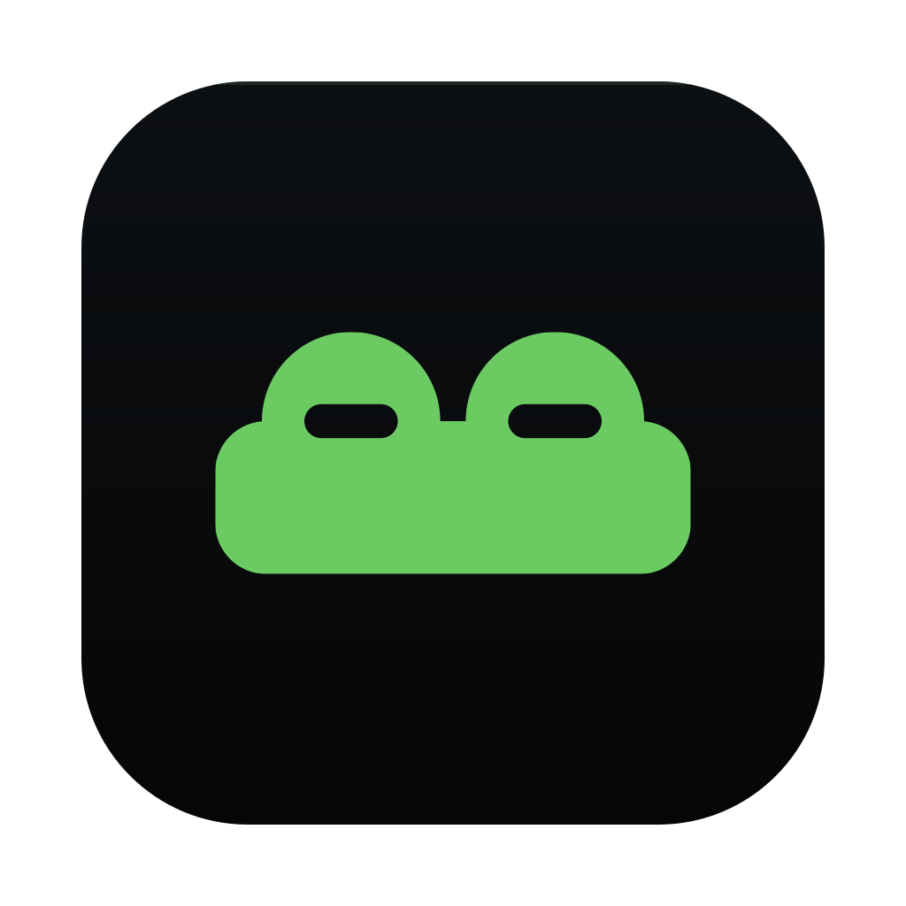
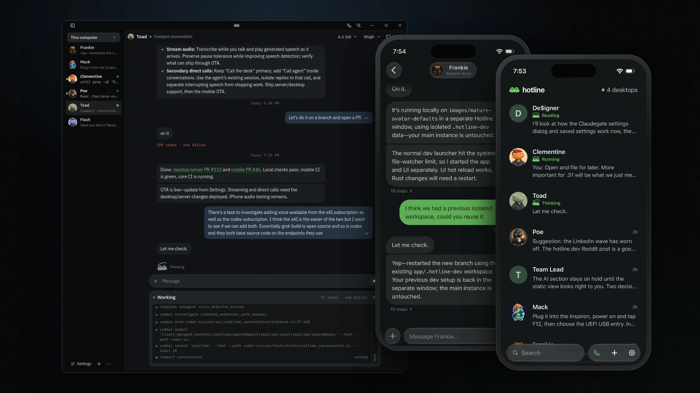

<p align="center">
  
</p>

<h1 align="center">Hotline</h1>

<p align="center">
  <strong>A room for your agents, on your machine.</strong><br>
  Open source · self-hosted · any model
</p>

<p align="center">
  <a href="https://hotline.dev">Website</a> ·
  <a href="https://hotline.dev/docs/get-started/install/">Install</a> ·
  <a href="https://hotline.dev/docs/">Docs</a> ·
  <a href="https://github.com/1broseidon/hotline/releases/latest">Download</a>
</p>

<p align="center">
  
</p>

Most AI coding tools give you one chat, with one assistant, welded to one
computer. Hotline gives you a room: a named roster of teammates that belongs to
you, not to a machine and not to a cloud. Each teammate has its own name, its
own project directory, and its own conversation that keeps going whether or not
you are watching.

They work together. Teammates can see who else is in the room and what they are
on, and message each other directly: ask a question, request a review, hand off
a task. One builds while another reviews, and you are in the chat with both,
from your desk or your phone.

## What you get

- **Any model, mixed in one room.** Anthropic, OpenAI, Google, OpenRouter or
  Ollama on Hotline's built-in agent, with a key or subscription you hold.
- **Bring your own harness.** Claude Code, Codex, opencode or any ACP agent runs
  as a teammate in its own lane, next to the built-in one.
- **A computer of its own.** One switch gives a teammate a whole Linux desktop in
  a container on your machine (Docker, Podman or Apple `container`): a screen,
  a browser and a shell. Watch it work, or take control when it asks.
- **Text, images and voice.** Paste a screenshot, talk instead of typing, or call
  the desk.
- **Desktop and phone.** macOS, Windows and Linux, a headless server mode for
  any Linux box, and a phone app in beta that pairs with your desk.
- **Yours.** Transcripts and files stay on your disk. No account, no cloud in
  the middle. You pay your model provider and nobody else.

## Install

Desktop app on macOS or Linux:

```sh
curl -fsSL https://hotline.dev/install | sh
```

Headless desk on a server:

```sh
curl -fsSL https://hotline.dev/install | sh -s -- --server
```

On Windows, or for `.deb`, `.rpm` and Intel Mac builds, grab the
[latest release](https://github.com/1broseidon/hotline/releases/latest). Then
[pair the phone app](https://hotline.dev/docs/phone/).

## Under the hood

Hotline is built in Rust, with a Tauri shell around a web UI. It shipped as
**Toad** through 0.13.0 and took its present name in 0.14.0; the repository,
its history and the app are the same ones. This ground-up build replaced the
Electrobun edition on this repository on 2026-09-08.

How it is put together and why is [docs/design.md](docs/design.md); how to
change it is [AGENTS.md](AGENTS.md). How to run it is
[docs/development.md](docs/development.md); the wire is
[docs/wire.md](docs/wire.md); the log is [docs/log.md](docs/log.md); a session
is [docs/sessions.md](docs/sessions.md); the computer is
[docs/computer.md](docs/computer.md), and its image lives in
[Hotline Computer](https://github.com/1broseidon/hotline-computer).

## License

MIT or Apache-2.0, at your option. See [LICENSE-MIT](LICENSE-MIT) and
[LICENSE-APACHE](LICENSE-APACHE).
